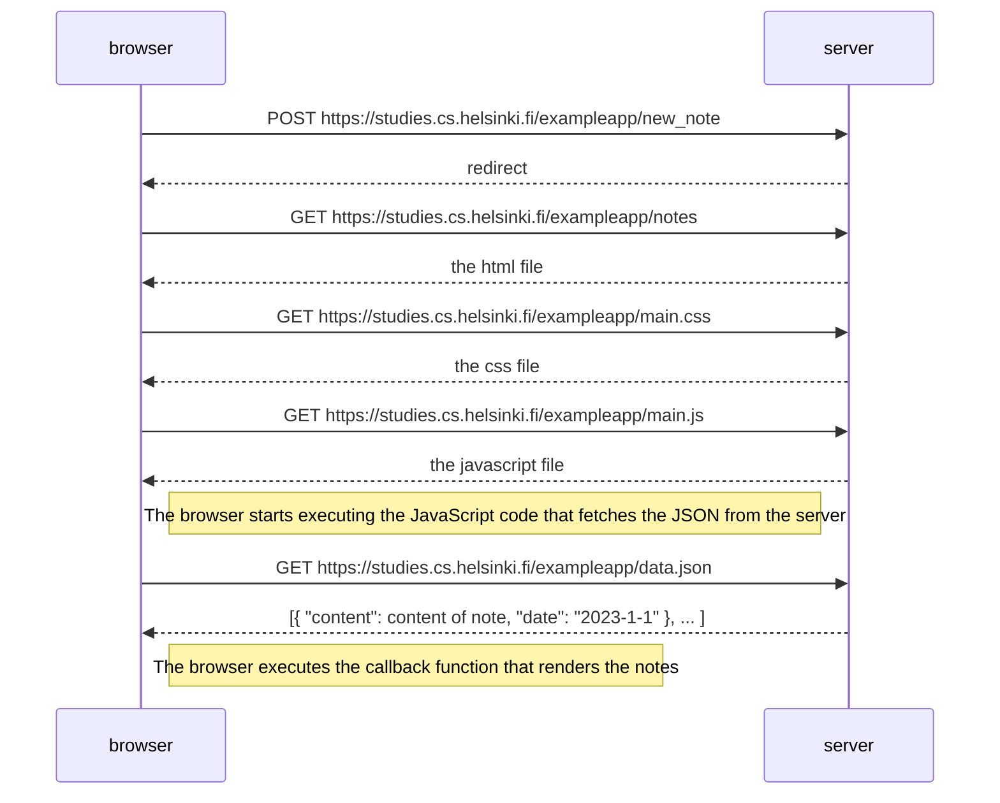

```mermaid
sequenceDiagram
    participant browser
    participant server

    browser->>server: POST https://studies.cs.helsinki.fi/exampleapp/new_note
    server-->>browser: redirect
    
    browser->>server: GET https://studies.cs.helsinki.fi/exampleapp/notes
    server-->>browser: the html file


    browser->>server: GET https://studies.cs.helsinki.fi/exampleapp/main.css
    server-->>browser: the css file


    browser->>server: GET https://studies.cs.helsinki.fi/exampleapp/main.js
    server-->>browser: the javascript file

    
    Note right of browser: The browser starts executing the JavaScript code that fetches the JSON from the server
    
    browser->>server: GET https://studies.cs.helsinki.fi/exampleapp/data.json
    server-->>browser: [{ "content": content of note, "date": "2023-1-1" }, ... ] 

    Note right of browser: The browser executes the callback function that renders the notes 
    
```