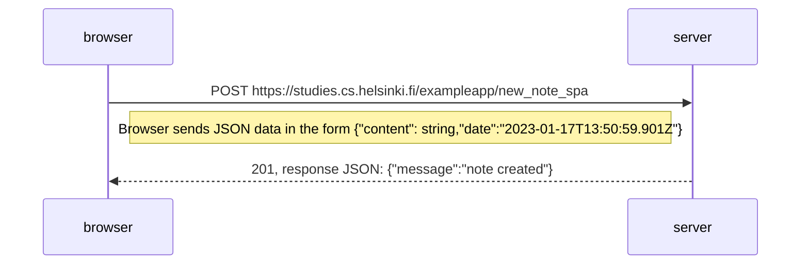

```mermaid
sequenceDiagram
    participant browser
    participant server
    
    browser->>server: POST https://studies.cs.helsinki.fi/exampleapp/new_note_spa
    
    Note right of browser: Browser sends JSON data in the form {"content": string,"date":"2023-01-17T13:50:59.901Z"}

    server-->>browser: 201, response JSON: {"message":"note created"}
    
```